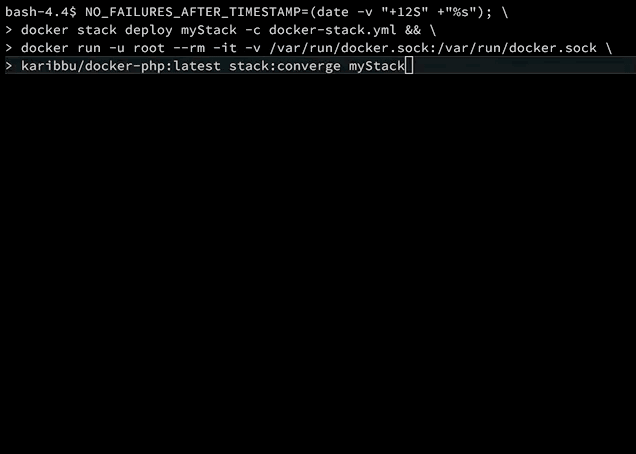

# docker-php

docker-php is a docker client writen in php. You can see it as a hack for some currently missing features in the official docker client.

## Born

The primary need was to find a workaround about docker stack deploy as at the time of the creation of this project it don't support some `--detach=false` option (see [docker/cli#373](https://github.com/docker/cli/issues/373)), so when it come to run end to end (e2e) tests on your `ci` (or your local machine) with some freshly deployed docker stack... you probably then launch your tests on a not ready stack!

## Commands

There's currently only one command:

```shell
docker run --rm -it -v /var/run/docker.sock:/var/run/docker.sock ubirak/docker-php:latest stack:converge <stack>
```



For help and more options:

```shell
docker run --rm -it ubirak/docker-php:latest stack:converge --help
```

**NOTE**: this command is also able to track that short lived services of a deployment should reach successfully their shutdown state. You have to add a `docker-php.service.lifecycle=shortlived` on concerned services.

## Audience

docker-php is intended for people that want to hack around docker client for missing/not merged features.

## Troubleshooting

> Error thrown while running command "stack:converge website_designer". Message: "The command "docker stack ps website_designer --format='{{json .}}'" failed.

The service need access to your docker sock. You can run it as root `-u root` or change the read permission of your `/var/run/docker.sock`

# Licensing

docker-php is licensed under the Apache License, Version 2.0. See [LICENSE](https://github.com/ubirak/docker-php/blob/master/LICENSE) for the full license text.
